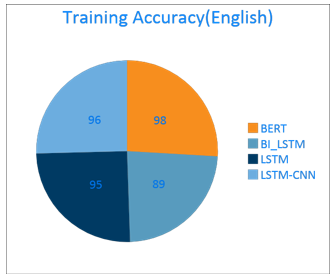
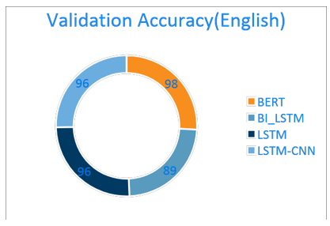
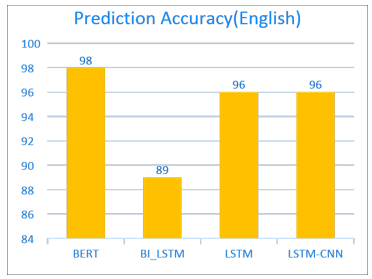
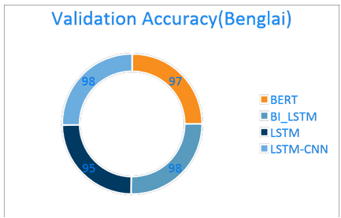
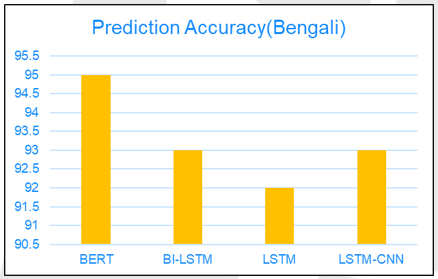
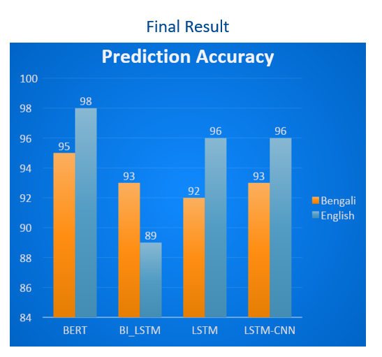

# Fake News Detection Using Deep Learning Model

## Introduction
The project aims to detect Fake News in both English and Bengali languages, emphasizing challenges in low-resource linguistic scenarios.
## Abstract
In a world where misinformation rapidly shapes public opinion, our system provides a high-accuracy solution. Employing advanced machine learning techniques, we achieved remarkable accuracy—98% in English and 93% in Bengali—for fake news detection.
## SYSTEM OVERVIEW
## Models Employed
- LSTM & BI-LSTM: Understands sequential data, capturing long-term dependencies.
- CNN-LSTM: A hybrid model combining CNN's feature extraction with LSTM's sequential data processing.
- BERT: Leverages transformer architecture for state-of-the-art NLP performance.
## Data Processing
- Preprocessing: Applied standard text cleaning methods—tokenization, lemmatization, and stop word removal.
- Vectorization: Transformed text data into numerical format using TF-IDF and Word Embeddings for effective model training.
## Algorithm Implementation and Methodology

- Training Approach: Each model is trained separately on curated datasets with careful hyperparameter tuning.
- Evaluation Metrics: Used Accuracy, Precision, Recall, and F1 Score metrics to assess model performance.
- Methodology: Agile and RAD methodologies guided development for adaptability and rapid iteration.
## Datasets

- English Dataset: "WELFAKE" with 70,000 articles.
   (https://huggingface.co/datasets/davanstrien/WELFake)
- Bengali Dataset: Sourced from the BanFakeNews paper with 48,678 genuine and 1,299 fake articles.  
    (https://aclanthology.org/W18-5513/)

## Outputs

  

    
    
    
  

  

    
    
  

  

    
  

## Acknowledgements

I extend my sincere gratitude to the Department of Computer Science at Sam Houston State University for their invaluable support and guidance throughout this project.

